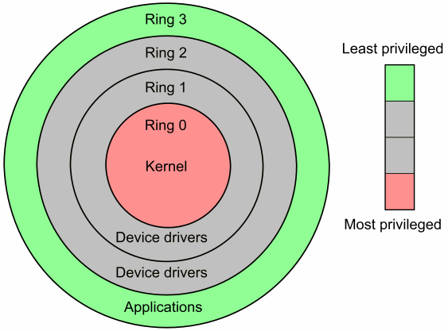

## **Kernels**


## Introduccion

<div style="text-align: justify"> 
El kernel es el núcleo central del sistema, es el encargado de administrar los recursos del sistema, como la memoria, el procesador, los dispositivos de entrada y salida, y las comunicaciones de red. Es el intermediario entre los programas y el hardware del sistema, y es el responsable de controlar y coordinar el acceso a estos recursos. El kernel también proporciona servicios esenciales como la gestión de procesos, la gestión de archivos, y la seguridad del sistema. En general, el kernel es el corazón de un sistema operativo y es lo que hace que un sistema sea estable y seguro.
</div>
<br/>

<center>

</center>


### Datos interesantes

```
El kernel puede existir sin el GNU (GNU solo son tools en binarios que este le provee al kernel.

La funcion prinicpal del este es la abtraccion de hardware y proporcionarnos una API
```

## Por que varios kernels?
<div style="text-align: justify"> 
En resumen, existen varios tipos de kernel en sistemas operativos debido a las diferentes arquitecturas de hardware, diseños y objetivos, licencias y código abierto y escalabilidad. Entre los diferentes tipos de kernel más comunes están:
</div>
<br/>


### Kernel monolítico: 
<div style="text-align: justify"> 
Este es el más simple y común tipo de los tipos de kernel. Este incluye la funcionalidad del sistema operativo y es compatible con todos los dispositivos conectados a él. En este los servicios de usuario y el kernel se implementan en el mismo espacio de memoria, y debido a este él su tamaño aumenta, lo que a su vez el tamaño del sistema operativo incrementa.
</div>
<br/>

### Micro Kernel: 
<div style="text-align: justify"> 
Estos son los más recientes y no son tan comunes como el kernel monolítico. Este incluye solo los servicios esenciales y los dispositivos necesarios para que el sistema funcione. Esto resulta en un Kernel pequeño y más rápida utilizando menos memoria. En este los servicios de usuario y el kernel están en diferentes espacios de memoria. Este fue separado en Espacio de User y Espacio de Kernel. Esto reduce el tamaño y resulta en el reducimiento del sistema operativo.
</div>
<br/>

### Kernel Hibrido: 
<div style="text-align: justify"> 
Este kernel como su nombre lo indica es un hibrido entre dos tipos de kernel, y estos son el <b>Kernel Monolíticos</b> y <b>Micro Kernel</b>. Este incluye más servicios que el micro kernel pero aún menos que el kernel monolítico. Esto permite ofrecer algunos de los mejores beneficios de ambos kernels. Esta toma la velocidad del kernel monolítico y la modularidad del micro kernel.
</div>
<br/>

### Nano Kernel: 
<div style="text-align: justify"> 
Este es el kernel más pequeño de los tipos de Kernel. Este consiste en solo unos pocos miles de líneas de código (para ser un kernel, si son muy pocas líneas). Esto significa que el código que se ejecuta en modo privilegiado del hardware es mínimo. Este se utiliza principalmente en sistemas embebidos o dispositivos con recursos limitados.
</div>
<br/>

### Exo Kernel: 
<div style="text-align: justify"> 
Este posee protección y administración de recursos de manera separada, esto es adecuado para usar cuendo se realiza una personalización especifica de la aplicación. Este está diseñado para su uso en dispositivos móviles por dicha flexibilidad. Este es una variacion del micro kernel que incluye características adicionales para dispositivos móviles, como administración de energía y soporte para múltiples procesadores.
</div>
<br/>

<center>

</center>

## User vs Kernel mode
Durante el transcurso  del tiempo los diseñadores de computadoras han venido entendiendo la importancia de la seguridad y la necesidad de proteger algunos aspectos críticos del comportamiento de la computadora, incluso mucho antes del internet o la aparición de la redes compartidas, ellos han administrado como los componentes de software accedían al hardware y a los recursos del sistema. Los procesadores se desarrollaron para administrar dos modos operativos los cuales son:

### User mode
Este modo se refiere al modo de procesador que permite que las aplicaciones basadas en el usuario, como un procesador de texto o videojuego, se carguen y ejecuten. El kernel prepara el espacio de memoria y los recursos para el uso de dichas aplicaciones y ejecuta la aplicación dente de ese espacio de memoria del usuario.

### Kernel mode
Este modo se refiere al modo de procesador que permite que el software tenga el acceso a los recursos de manera completa y sin restricciones. El SO kernel y los controladores del kernel, como el controlador del sistema de archivos, se cargan en un espacio de memoria protegido y funcionan en este modo kernel altamente privilegiado.




### Kernel en conclusión
<div style="text-align: justify"> 
El kernel es responsable de manejar los recursos del sistema y asegurar que todas las partes del sistema operativo trabajen de manera coordinada. Al entender cómo funciona el kernel, se pueden solucionar problemas de manera más eficiente y mejorar el rendimiento del equipo.
</div>
<br/>

### E-grafias:
- Bigelow, S. J., & Lulka, J. (2022, 15 agosto). kernel. Data Center. https://www.techtarget.com/searchdatacenter/definition/kernel  
  
- Kenels and Types. (s. f.). GitHub. https://github.com/nu11secur1ty/Kernel-and-Types-of-kernels/blob/master/Kernel%20and%20Types%20of%20kernels.md
- What is Kernel and different types of Kernels? (s. f.). https://www.tutorialspoint.com/what-is-kernel-and-different-types-of-kernels 
- What is Kernel in Operating System and what are the various types of Kernel? (s. f.). https://afteracademy.com/blog/what-is-kernel-in-operating-system-and-what-are-the-various-types-of-kernel/


