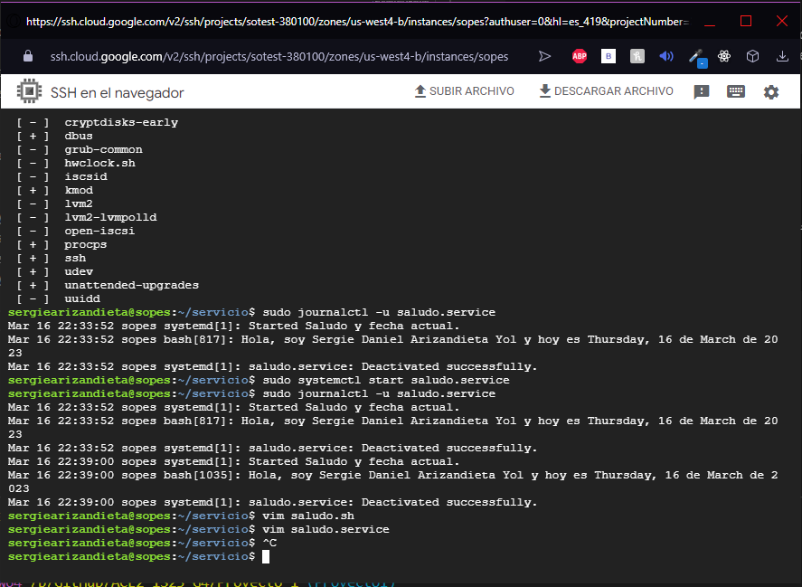

## Actividad 4 - Proceso de creación / instalación del servicio

### Pasos:
1. Se debe crear el archivo saludo.service y saludo.sh
2. El archivo .sh es el que se ejecutara cuando inicie el proceso, por lo mismo de vería incluir aquí el saludo:
```
#!/usr/bin/bash
echo "Hola, soy Sergie Daniel Arizandieta Yol y hoy es $(date +%A), $(date +%d) de $(date +%B) de $(date +%Y)"
```
3. En el archivo saludo.service, ingresa el siguiente código:
```
[Unit]
Description=Saludo y fecha actual

[Service]
Type=simple
ExecStart=/usr/bin/bash /ruta/al/script/saludo.sh

[Install]
WantedBy=multi-user.target
```
- [Unit]: esta sección define los metadatos del servicio, como el nombre del servicio y una descripción.

- Description=Saludo y fecha actual: esta línea define la descripción del servicio.

- [Service]: esta sección define cómo se debe ejecutar el servicio.

- Type=simple: esto indica que el servicio es de tipo "simple", lo que significa que el proceso se ejecutará en primer plano y se considerará que ha finalizado cuando el script termine de ejecutarse.

- ExecStart=/usr/bin/bash /ruta/al/script/saludo.sh: esta línea indica la ruta del script que se ejecutará cuando se inicie el servicio.

- [Install]: esta sección define cuándo y cómo el servicio debe ser instalado y habilitado.

- WantedBy=multi-user.target: esto indica que el servicio debe ser iniciado automáticamente al arrancar el sistema en el nivel de ejecución multiusuario.

4. Ahora, para instalar el servicio, se debe copiar el archivo saludo.service en la carpeta /etc/systemd/system/. Para hacerlo, puedes ejecutar el siguiente comando:

```
sudo cp saludo.service /etc/systemd/system/
```

5. Una vez que se haya copiado el archivo saludo.service, se puede activar el servicio usando el siguiente comando:

```
sudo systemctl enable saludo.service
```

6. Finalmente, se puede iniciar el servicio con el siguiente comando:
```
sudo systemctl start saludo.service
```

7. Para ver la salida el servicio se puede ejecutar
```
sudo journalctl -u saludo.service

<!-- Ya que en la mayoría de las distribuciones Linux modernas, el registro de sistema se encuentra en /var/log/syslog o en /var/log/messages. -->
```
En mi caso la salida en una máquina virtual de google con Ubuntu fue:

```
Mar 16 22:39:00 sopes systemd[1]: Started Saludo y fecha actual.
Mar 16 22:39:00 sopes bash[1035]: Hola, soy Sergie Daniel Arizandieta Yol y hoy es Thursday, 16 de March de 2023
Mar 16 22:39:00 sopes systemd[1]: saludo.service: Deactivated successfully.
```



